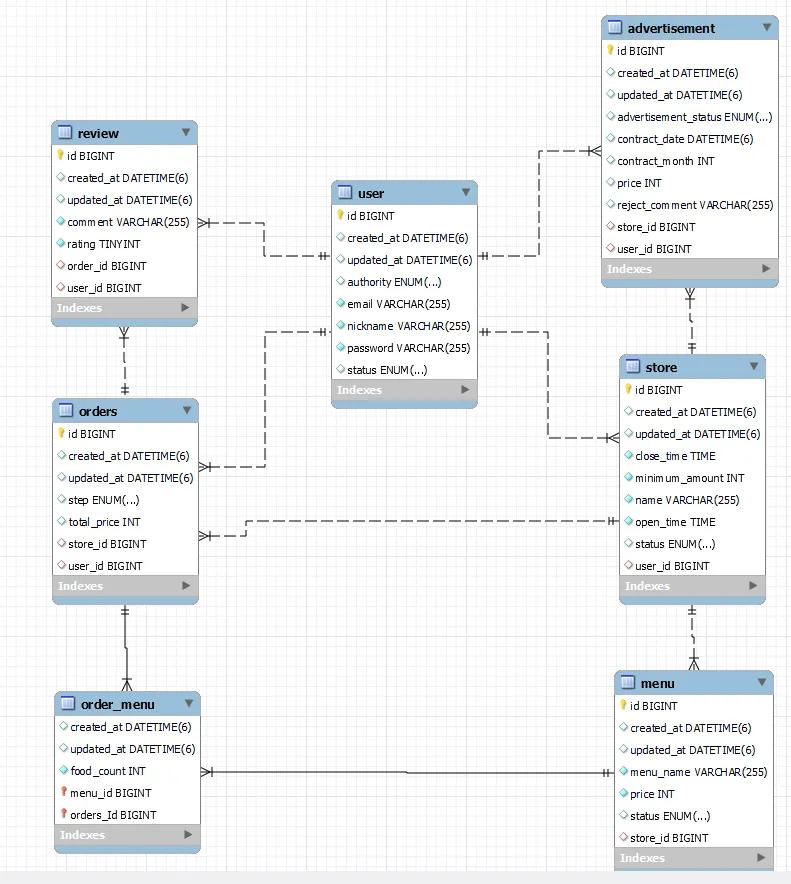

# 프로젝트명: 먹고!

## 프로젝트 설명
- 먹'go' 싶은 음식의 주문을 'go' 하라는 의미의 배달앱!
- 고객들에게 가게 메뉴를 보여주고 주문을 받고 리뷰를 달 수 있는 기능과 사장님이 가게 및 메뉴 관리와 광고신청을 할 수 있으며 관리자가 광고 승인 및 거절을 할 수 있는 배달 앱을 구현하는 프로젝트

---
## 기능
- 유저
  - 회원가입
  - 로그인
  - 회원탈퇴
- 가게
  - 가게 생성
  - 가게 수정
  - 가게 폐업
  - 가게로 들어온 주문 조회
  - 가게로 들어온 주문 수락
  - 검색어로 가게 조회
  - 가게 단건 조회
  - 자신의 가게 조회
- 메뉴
  - 메뉴 생성
  - 메뉴 수정
  - 메뉴 삭제
- 광고
  - 광고 신청
  - 자신의 광고요청 전체 조회
- 주문
  - 주문 생성
  - 주문 단건조회
  - 주문 전체 조회
- 리뷰
  - 리뷰 생성
  - 리뷰 조회
- 장바구니
  - 장바구니 조회
  - 장바구니 주문하기
- 관리자
  - 일간 통계 조회
  - 월간 통계 조회
  - 원하는 날짜들의 사이 통계 조회
  - 광고 전체 조회
  - 광고 승인
  - 광고 거절

## ERD
- user table
- store table
- menu table
- order_menu table
- orders table
- review table
- advertisement table

---
## Troubleshooting
- 중복이메일 관련 쿼리 성능 이슈
  - 유저 email 가 중복인지 검사하는데 불필요한 데이터를 들고옴
  - JPA 메소드를 활용하여 해결 exists....By()
- 리스트를 속성으로 반환하는 법
  - responsebody의 order는 리스트로 받아와야 함
  - List<OrderDto> order 부분에 OrderDto 만들어서 넣어서 해결
- 비슷한 데이터를 불러오는 과정에서 코드를 줄이고 유연하게 처리하는 법
  - 쿼리 DSL을 사용
- JPQL로 결과를 곱할때 타입 불일치 문제
  - 타입이 BigDecimal로 자동으로 반환되는 문제
  - Bigdecimal로 타입캐스팅화 int로 변환하여 해결
- 쿠기 형변환 문제 (encode&decode, 직렬화, 역직렬화)
  - 문자열이 dto로 변환이 안됨 -> objectMapper 사용
  - 쿠키값은 JSON이므로 그대로 사용이 안됨 -> 디코딩 진행
  - URL 인코딩된 데이터를 원래의 JSON 형태로 복원
  - JSON 데이터를 처리
  - 문자열 비교, JSON 파싱 등 후속 작업이 가능하도록 데이터를 가공